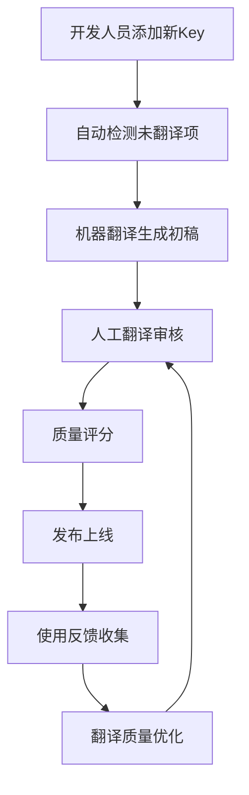

# 锂电池包装MES系统 - 架构升级指南

## 概述

本指南详细介绍了锂电池包装MES系统的三大核心升级方向：

1. **事件驱动架构（Event-Driven Architecture）** - 系统解耦与实时响应
2. **国际化（Internationalization）** - 全球化市场扩展支持  
3. **高级分析与智能制造（Advanced Analytics & Smart Manufacturing）** - 数据驱动的智能决策

## 1. 事件驱动架构升级

### 1.1 架构概述

事件驱动架构通过事件总线实现系统组件间的松耦合通信，提高系统的可扩展性和响应性。

```
┌─────────────────┐    事件发布    ┌─────────────────┐    事件订阅    ┌─────────────────┐
│   生产设备      │ ────────────→ │   事件总线      │ ────────────→ │   业务处理      │
│   质量检测      │               │   (Redis)       │               │   告警系统      │
│   设备监控      │               │                 │               │   数据分析      │
└─────────────────┘               └─────────────────┘               └─────────────────┘
                                          │
                                          ↓
                                  ┌─────────────────┐
                                  │   事件存储      │
                                  │   (历史记录)    │
                                  └─────────────────┘
```

### 1.2 核心组件

#### 事件基类
```csharp
// 领域事件基类
public abstract class BaseEvent
{
    public Guid EventId { get; }
    public DateTimeOffset OccurredOn { get; }
    public string Version { get; protected set; }
    public string AggregateId { get; protected set; }
    public int? UserId { get; set; }
    public Dictionary<string, object> Metadata { get; set; }
}

// 集成事件基类
public abstract class IntegrationEvent : BaseEvent
{
    public string Source { get; set; } = "BatteryPackingMES";
    public string? Target { get; set; }
    public int RetryCount { get; set; } = 0;
    public int MaxRetries { get; set; } = 3;
}
```

#### 主要事件类型

| 事件类型 | 触发场景 | 主要用途 |
|---------|---------|---------|
| `ProductionBatchCreatedEvent` | 生产批次创建 | 触发资源分配、计划调度 |
| `ProductionBatchStatusChangedEvent` | 批次状态变更 | 更新进度、通知相关部门 |
| `QualityInspectionCompletedEvent` | 质量检测完成 | 更新质量数据、触发后续工序 |
| `EquipmentFailureEvent` | 设备故障 | 紧急停机、维护调度 |
| `ProcessParameterOutOfRangeEvent` | 参数超限 | 质量预警、参数调整 |

### 1.3 事件总线实现

```csharp
// 基于Redis的事件总线
public class EventBusService : IEventBus
{
    public async Task PublishAsync<T>(T @event) where T : BaseEvent
    {
        // 1. 序列化事件
        var eventJson = JsonSerializer.Serialize(@event);
        
        // 2. 发布到Redis频道
        await _subscriber.PublishAsync(GetChannelName<T>(), eventJson);
        
        // 3. 保存到事件存储
        await _eventStore.SaveEventAsync(@event);
        
        // 4. 记录指标
        await RecordEventMetrics(typeof(T).Name, "published");
    }

    public async Task SubscribeAsync<T>(Func<T, CancellationToken, Task> handler) where T : BaseEvent
    {
        await _subscriber.SubscribeAsync(GetChannelName<T>(), async (channel, message) =>
        {
            var @event = JsonSerializer.Deserialize<T>(message);
            await handler(@event, CancellationToken.None);
        });
    }
}
```

### 1.4 使用示例

```csharp
// 发布事件
await _eventBus.PublishAsync(new ProductionBatchCreatedEvent(
    batchNumber: "BATCH_20241215_001",
    productModel: "BT-18650-3000mAh",
    plannedQuantity: 1000,
    workshopCode: "WS001"
));

// 订阅事件
await _eventBus.SubscribeAsync<ProductionBatchCreatedEvent>(async (@event, ct) =>
{
    // 自动分配资源
    await _resourceService.AllocateResourcesAsync(@event.BatchNumber, @event.PlannedQuantity);
    
    // 生成作业指导书
    await _instructionService.GenerateWorkInstructionsAsync(@event.BatchNumber, @event.ProductModel);
    
    // 发送通知
    await _notificationService.NotifyProductionStartAsync(@event.BatchNumber);
});
```

### 1.5 优势与效果

- **系统解耦**: 生产模块、质量模块、设备模块独立部署和升级
- **实时响应**: 事件驱动的即时处理，响应时间从分钟级降至秒级
- **扩展性**: 新增业务模块只需订阅相关事件，无需修改现有代码
- **容错性**: 事件重试机制和死信队列保证消息不丢失
- **审计追踪**: 完整的事件历史记录，便于问题排查和数据分析

## 2. 国际化（I18n）升级

### 2.1 多语言支持架构

```
┌─────────────────┐    请求     ┌─────────────────┐    查询     ┌─────────────────┐
│   客户端        │ ─────────→ │  本地化服务     │ ─────────→ │  资源存储       │
│ (Accept-Lang)   │            │  (缓存策略)     │            │  (数据库+Redis)  │
└─────────────────┘            └─────────────────┘            └─────────────────┘
                                         │
                                         ↓
                               ┌─────────────────┐
                               │  格式化服务     │
                               │ (日期/数字/货币) │
                               └─────────────────┘
```

### 2.2 支持的语言

| 语言代码 | 语言名称 | 本地名称 | 状态 | 完成度 |
|---------|---------|---------|------|-------|
| zh-CN | Chinese (Simplified) | 简体中文 | ✅ 默认 | 100% |
| en-US | English (United States) | English | ✅ 活跃 | 95% |
| ja-JP | Japanese | 日本語 | ✅ 活跃 | 85% |
| ko-KR | Korean | 한국어 | 🚧 开发中 | 60% |
| de-DE | German | Deutsch | 🚧 开发中 | 45% |
| fr-FR | French | Français | 📋 计划中 | 20% |

### 2.3 本地化资源管理

#### 资源结构
```csharp
public class LocalizationResource : BaseEntity
{
    public string Key { get; set; }           // 资源键: "Production.BatchStatus.Running"
    public string LanguageCode { get; set; }  // 语言代码: "zh-CN"
    public string Value { get; set; }         // 翻译值: "运行中"
    public string Category { get; set; }      // 分类: "Production"
    public bool IsApproved { get; set; }      // 是否审核通过
    public bool IsAutoTranslated { get; set; } // 是否机器翻译
    public int QualityScore { get; set; }     // 翻译质量评分 (1-5)
}
```

#### 分层缓存策略
```
第一层: 内存缓存 (30分钟)
    ↓ (缓存未命中)
第二层: Redis缓存 (2小时)  
    ↓ (缓存未命中)
第三层: 数据库查询
    ↓ (找不到翻译)
第四层: 返回原始Key或默认语言
```

### 2.4 使用示例

#### 控制器中使用
```csharp
[HttpGet]
public async Task<ActionResult> GetProductionStatus()
{
    var status = await _productionService.GetCurrentStatusAsync();
    
    return Ok(new
    {
        Status = _localizationService.GetString($"Production.Status.{status}"),
        Message = _localizationService.GetString("Production.StatusMessage", 
            new object[] { status, DateTime.Now }),
        Timestamp = _localizationService.GetLocalizedDate(DateTime.Now)
    });
}
```

#### 客户端请求
```http
GET /api/v2.0/production/status
Accept-Language: ja-JP,en-US;q=0.9,zh-CN;q=0.8

Response:
{
    "status": "稼働中",
    "message": "生産ラインは稼働中です (2024年12月15日 10:30)",
    "timestamp": "令和6年12月15日"
}
```

### 2.5 翻译工作流



### 2.6 翻译管理API

```csharp
// 批量导入翻译
POST /api/v2.0/localization/import/{languageCode}
{
    "Common.Save": "保存",
    "Common.Cancel": "取消",
    "Production.BatchNumber": "批次号"
}

// 导出翻译文件
GET /api/v2.0/localization/export/{languageCode}?format=json

// 搜索翻译
GET /api/v2.0/localization/search?lang=zh-CN&term=批次&category=Production
```

## 3. 高级分析与智能制造

### 3.1 智能制造架构

```
┌─────────────────┐
│   数据采集层    │ ← 设备传感器、PLC、SCADA、人工录入
└─────────┬───────┘
          │
┌─────────▼───────┐
│   数据处理层    │ ← 清洗、转换、验证、存储
└─────────┬───────┘
          │
┌─────────▼───────┐
│   分析引擎层    │ ← 统计分析、机器学习、预测模型
└─────────┬───────┘
          │
┌─────────▼───────┐
│   智能决策层    │ ← 优化建议、自动调节、预警告警
└─────────┬───────┘
          │
┌─────────▼───────┐
│   可视化展示层  │ ← 仪表板、报表、移动端
└─────────────────┘
```

### 3.2 核心分析功能

#### 3.2.1 生产效率分析

**OEE (Overall Equipment Effectiveness) 计算**
```csharp
public class OEEMetrics
{
    // OEE = 可用率 × 性能率 × 质量率
    public decimal OverallOEE => Availability * Performance * Quality;
    
    // 可用率 = 实际运行时间 / 计划生产时间
    public decimal Availability { get; set; }
    
    // 性能率 = (实际产量 × 理想节拍时间) / 实际运行时间  
    public decimal Performance { get; set; }
    
    // 质量率 = 合格品数量 / 总产量
    public decimal Quality { get; set; }
}
```

**效率趋势分析**
- 按时间维度分析效率变化趋势
- 识别效率瓶颈和改进机会
- 对比不同产线、班次的效率差异

#### 3.2.2 质量预测与控制

**质量控制图**
```csharp
public class QualityControlChart
{
    public decimal UpperControlLimit { get; set; }  // 上控制限 UCL
    public decimal LowerControlLimit { get; set; }  // 下控制限 LCL  
    public decimal CenterLine { get; set; }         // 中心线 CL
    public List<ControlPoint> ControlPoints { get; set; }
    public List<string> OutOfControlPoints { get; set; } // 失控点
}
```

**质量预测模型**
- 基于历史数据训练机器学习模型
- 实时预测批次质量风险
- 提供预防性质量改进建议

#### 3.2.3 设备健康度监控

**设备健康评分算法**
```csharp
public decimal CalculateHealthScore(EquipmentStatusMetrics metrics)
{
    var availabilityScore = metrics.Availability * 0.3m;      // 可用性权重30%
    var mtbfScore = NormalizeMTBF(metrics.MTBF) * 0.25m;     // MTBF权重25%
    var mttrScore = NormalizeMTTR(metrics.MTTR) * 0.2m;      // MTTR权重20%
    var vibrationScore = NormalizeVibration(metrics.VibrationLevel) * 0.15m; // 振动权重15%
    var temperatureScore = NormalizeTemperature(metrics.Temperature) * 0.1m; // 温度权重10%
    
    return (availabilityScore + mtbfScore + mttrScore + vibrationScore + temperatureScore) * 100;
}
```

**预测性维护**
- 基于传感器数据预测设备故障
- 制定最优维护计划
- 减少非计划停机时间

#### 3.2.4 能耗优化分析

**能耗效率指标**
```csharp
public class EnergyEfficiencyMetrics
{
    // 单位产品能耗 = 总能耗 / 产量
    public decimal ConsumptionPerUnit { get; set; }
    
    // 生产能耗比 = 生产用电 / 总用电
    public decimal ProductionEnergyRatio { get; set; }
    
    // 浪费能耗比例 = 浪费能耗 / 总能耗
    public decimal WasteEnergyPercentage { get; set; }
    
    // 与基准对比 = (当前能耗 - 基准能耗) / 基准能耗
    public decimal BenchmarkComparison { get; set; }
}
```

### 3.3 机器学习模型

#### 3.3.1 质量预测模型

**训练数据结构**
```csharp
public class QualityTrainingData
{
    public string BatchNumber { get; set; }
    public Dictionary<string, object> ProcessParameters { get; set; } // 工艺参数
    public bool QualityResult { get; set; }           // 质量结果 (合格/不合格)
    public List<string> DefectTypes { get; set; }     // 缺陷类型
    public DateTimeOffset ProductionDate { get; set; }
}
```

**模型特征工程**
- 工艺参数标准化
- 时间序列特征提取
- 缺陷模式编码
- 环境因素关联

#### 3.3.2 设备故障预测模型

**传感器数据处理**
```csharp
public class EquipmentTrainingData
{
    public string EquipmentCode { get; set; }
    public Dictionary<string, object> SensorData { get; set; } // 传感器数据
    public bool FailureOccurred { get; set; }        // 是否发生故障
    public string FailureType { get; set; }          // 故障类型
    public DateTimeOffset DataTimestamp { get; set; }
}
```

**异常检测算法**
- 基于统计的异常检测 (Z-Score, IQR)
- 基于机器学习的异常检测 (Isolation Forest, One-Class SVM)
- 时间序列异常检测 (LSTM, Prophet)

### 3.4 实时分析仪表板

#### 关键性能指标 (KPI)
```csharp
public class KPIMetric
{
    public string Name { get; set; }           // 指标名称
    public decimal CurrentValue { get; set; }  // 当前值
    public decimal TargetValue { get; set; }   // 目标值
    public string Status { get; set; }         // 状态 (正常/警告/异常)
    public decimal TrendPercentage { get; set; } // 趋势百分比
}
```

#### 实时告警系统
```csharp
public class RealTimeAlert
{
    public string Type { get; set; }      // 告警类型
    public string Severity { get; set; }  // 严重程度 (高/中/低)
    public string Source { get; set; }    // 告警源
    public string Message { get; set; }   // 告警消息
    public bool IsAcknowledged { get; set; } // 是否已确认
}
```

### 3.5 使用示例

#### 获取生产效率分析
```http
GET /api/v2.0/advanced-analytics/production-efficiency
    ?from=2024-12-01T00:00:00Z
    &to=2024-12-15T23:59:59Z
    &workshopCode=WS001

Response:
{
    "overall": {
        "productionEfficiency": 87.5,
        "qualityRate": 98.2,
        "onTimeDeliveryRate": 95.8,
        "efficiencyGrade": "优秀"
    },
    "oee": {
        "overallOEE": 82.3,
        "availability": 94.2,
        "performance": 91.5,
        "quality": 95.6
    },
    "factorAnalysis": {
        "bottleneckProcesses": ["电芯装配", "电压测试"],
        "improvementOpportunities": ["优化换料时间", "减少设备调试时间"]
    }
}
```

#### 预测设备故障
```http
POST /api/v2.0/advanced-analytics/ml/predict-equipment-failure
{
    "equipmentCode": "EQ001",
    "sensorData": {
        "temperature": 75.5,
        "vibration": 2.3,
        "pressure": 1.2,
        "current": 15.8
    }
}

Response:
{
    "failureProbability": 15.7,
    "predictedFailureDate": "2024-12-25T14:30:00Z",
    "failureType": "轴承磨损",
    "severity": "中等",
    "warningSignals": [
        "温度持续上升",
        "振动频率异常"
    ]
}
```

#### 生成优化建议
```http
POST /api/v2.0/advanced-analytics/optimization-suggestions
{
    "workshopCode": "WS001",
    "analysisDate": "2024-12-15"
}

Response:
{
    "productionSuggestions": [
        {
            "category": "效率优化",
            "title": "优化换料流程",
            "description": "建议采用快速换料技术，预计可减少换料时间30%",
            "expectedImprovement": 5.2,
            "priority": "高"
        }
    ],
    "equipmentSuggestions": [
        {
            "equipmentCode": "EQ001",
            "category": "预防性维护",
            "title": "提前更换轴承",
            "description": "基于振动分析，建议在下次计划停机时更换轴承",
            "expectedEfficiencyGain": 3.5,
            "priority": "中"
        }
    ],
    "expectedBenefit": {
        "totalExpectedSaving": 150000,
        "efficiencyGain": 8.7,
        "qualityImprovement": 2.3,
        "roi": 320
    }
}
```

## 4. 部署与配置

### 4.1 Docker容器化部署

#### docker-compose.yml 更新
```yaml
version: '3.8'

services:
  battery-mes-api:
    build: .
    environment:
      - ASPNETCORE_ENVIRONMENT=Production
      - ConnectionStrings__DefaultConnection=${DB_CONNECTION_STRING}
      - Redis__ConnectionString=${REDIS_CONNECTION_STRING}
      - EventBus__Enabled=true
      - Localization__DefaultLanguage=zh-CN
      - Analytics__EnableRealTimeProcessing=true
      - ML__ModelStoragePath=/app/models
    volumes:
      - ml-models:/app/models
    depends_on:
      - mysql
      - redis
      - influxdb

  # 事件处理服务
  event-processor:
    build: 
      context: .
      dockerfile: Dockerfile.EventProcessor
    environment:
      - ASPNETCORE_ENVIRONMENT=Production
      - Redis__ConnectionString=${REDIS_CONNECTION_STRING}
    depends_on:
      - redis

  # 分析计算服务  
  analytics-engine:
    build:
      context: .
      dockerfile: Dockerfile.Analytics
    environment:
      - ASPNETCORE_ENVIRONMENT=Production
      - InfluxDB__ConnectionString=${INFLUXDB_CONNECTION_STRING}
      - ML__PythonServiceUrl=http://ml-service:8000
    depends_on:
      - influxdb
      - ml-service

  # 机器学习服务 (Python)
  ml-service:
    image: python:3.9-slim
    volumes:
      - ./ml-service:/app
      - ml-models:/app/models
    working_dir: /app
    command: python app.py
    environment:
      - MODEL_PATH=/app/models

volumes:
  ml-models:
```

### 4.2 配置文件

#### appsettings.Production.json
```json
{
  "EventBus": {
    "Enabled": true,
    "Redis": {
      "ConnectionString": "localhost:6379",
      "Database": 1
    },
    "RetryPolicy": {
      "MaxRetries": 3,
      "RetryDelayMs": 1000
    }
  },
  
  "Localization": {
    "DefaultLanguage": "zh-CN",
    "SupportedLanguages": [
      "zh-CN", "en-US", "ja-JP", "ko-KR", "de-DE", "fr-FR"
    ],
    "CacheSettings": {
      "MemoryCacheDurationMinutes": 30,
      "RedisCacheDurationHours": 2
    }
  },
  
  "Analytics": {
    "EnableRealTimeProcessing": true,
    "BatchProcessingIntervalMinutes": 15,
    "DataRetentionDays": 365,
    "PerformanceThresholds": {
      "OEE": {
        "Excellent": 90.0,
        "Good": 80.0,
        "Average": 70.0
      }
    }
  },
  
  "MachineLearning": {
    "ModelStoragePath": "/app/models",
    "TrainingSchedule": "0 2 * * *",
    "PredictionCacheMinutes": 60,
    "ModelVersioning": {
      "MaxVersionsToKeep": 5,
      "AutoDeployThreshold": 0.95
    }
  }
}
```

### 4.3 数据库迁移

```sql
-- 事件存储表
CREATE TABLE EventStore (
    Id BIGINT AUTO_INCREMENT PRIMARY KEY,
    EventId VARCHAR(36) NOT NULL UNIQUE,
    EventType VARCHAR(255) NOT NULL,
    AggregateId VARCHAR(255) NOT NULL,
    EventData JSON NOT NULL,
    Metadata JSON,
    OccurredOn TIMESTAMP NOT NULL,
    Version VARCHAR(10) NOT NULL,
    INDEX idx_aggregate_id (AggregateId),
    INDEX idx_event_type (EventType),
    INDEX idx_occurred_on (OccurredOn)
);

-- 本地化资源表
CREATE TABLE LocalizationResources (
    Id INT AUTO_INCREMENT PRIMARY KEY,
    `Key` VARCHAR(500) NOT NULL,
    LanguageCode VARCHAR(10) NOT NULL,
    Value TEXT NOT NULL,
    Category VARCHAR(100) DEFAULT 'Common',
    Description TEXT,
    IsApproved BOOLEAN DEFAULT FALSE,
    ApprovedBy INT,
    ApprovedAt TIMESTAMP NULL,
    TranslatedBy INT,
    TranslatedAt TIMESTAMP NULL,
    Version INT DEFAULT 1,
    IsAutoTranslated BOOLEAN DEFAULT FALSE,
    QualityScore INT DEFAULT 0,
    CreatedAt TIMESTAMP DEFAULT CURRENT_TIMESTAMP,
    UpdatedAt TIMESTAMP DEFAULT CURRENT_TIMESTAMP ON UPDATE CURRENT_TIMESTAMP,
    UNIQUE KEY uk_key_language (`Key`, LanguageCode),
    INDEX idx_language_code (LanguageCode),
    INDEX idx_category (Category),
    INDEX idx_approved (IsApproved)
);

-- 支持的语言配置表
CREATE TABLE SupportedLanguageConfigs (
    Id INT AUTO_INCREMENT PRIMARY KEY,
    LanguageCode VARCHAR(10) NOT NULL UNIQUE,
    Name VARCHAR(100) NOT NULL,
    NativeName VARCHAR(100) NOT NULL,
    Flag VARCHAR(50),
    IsRightToLeft BOOLEAN DEFAULT FALSE,
    IsDefault BOOLEAN DEFAULT FALSE,
    IsEnabled BOOLEAN DEFAULT TRUE,
    DisplayOrder INT DEFAULT 0,
    CompletionPercentage DECIMAL(5,2) DEFAULT 0,
    LastTranslationUpdate TIMESTAMP DEFAULT CURRENT_TIMESTAMP,
    CurrencyCode VARCHAR(3) DEFAULT 'USD',
    DateFormat VARCHAR(50) DEFAULT 'yyyy-MM-dd',
    TimeFormat VARCHAR(50) DEFAULT 'HH:mm:ss',
    NumberFormat VARCHAR(50) DEFAULT '#,##0.##',
    CreatedAt TIMESTAMP DEFAULT CURRENT_TIMESTAMP,
    UpdatedAt TIMESTAMP DEFAULT CURRENT_TIMESTAMP ON UPDATE CURRENT_TIMESTAMP
);

-- 机器学习模型元数据表
CREATE TABLE MLModelMetadata (
    Id INT AUTO_INCREMENT PRIMARY KEY,
    ModelId VARCHAR(36) NOT NULL UNIQUE,
    ModelType VARCHAR(100) NOT NULL,
    Version VARCHAR(20) NOT NULL,
    Accuracy DECIMAL(5,4),
    Precision DECIMAL(5,4),
    Recall DECIMAL(5,4),
    F1Score DECIMAL(5,4),
    TrainingDate TIMESTAMP NOT NULL,
    Status VARCHAR(50) NOT NULL,
    ModelPath VARCHAR(500),
    TrainingDataSize INT,
    IsActive BOOLEAN DEFAULT FALSE,
    CreatedAt TIMESTAMP DEFAULT CURRENT_TIMESTAMP,
    UpdatedAt TIMESTAMP DEFAULT CURRENT_TIMESTAMP ON UPDATE CURRENT_TIMESTAMP,
    INDEX idx_model_type (ModelType),
    INDEX idx_status (Status),
    INDEX idx_is_active (IsActive)
);
```

## 5. 监控与运维

### 5.1 性能监控指标

| 指标类别 | 具体指标 | 目标值 | 监控方式 |
|---------|---------|-------|---------|
| **事件处理** | 事件发布延迟 | < 100ms | Prometheus + Grafana |
| **事件处理** | 事件处理成功率 | > 99.9% | 自定义指标 |
| **本地化** | 缓存命中率 | > 95% | Redis监控 |
| **本地化** | 翻译API响应时间 | < 50ms | APM工具 |
| **分析引擎** | 模型预测延迟 | < 500ms | 自定义监控 |
| **分析引擎** | 数据处理吞吐量 | > 1000 records/s | InfluxDB监控 |

### 5.2 告警规则

```yaml
# Prometheus告警规则
groups:
  - name: battery-mes-alerts
    rules:
      # 事件处理延迟告警
      - alert: HighEventProcessingLatency
        expr: event_processing_duration_seconds{quantile="0.95"} > 5
        for: 2m
        labels:
          severity: warning
        annotations:
          summary: "事件处理延迟过高"
          description: "95%分位数的事件处理时间超过5秒"

      # 模型预测准确率下降告警  
      - alert: MLModelAccuracyDrop
        expr: ml_model_accuracy < 0.8
        for: 5m
        labels:
          severity: critical
        annotations:
          summary: "机器学习模型准确率下降"
          description: "模型 {{ $labels.model_id }} 准确率降至 {{ $value }}"

      # 设备故障预警
      - alert: EquipmentFailurePrediction
        expr: equipment_failure_probability > 0.7
        for: 1m
        labels:
          severity: warning
        annotations:
          summary: "设备故障风险预警"
          description: "设备 {{ $labels.equipment_code }} 故障概率达到 {{ $value }}"
```

### 5.3 日志收集

```yaml
# Filebeat配置
filebeat.inputs:
  - type: log
    enabled: true
    paths:
      - /app/logs/*.log
    fields:
      service: battery-mes
      environment: production
    multiline.pattern: '^\d{4}-\d{2}-\d{2}'
    multiline.negate: true
    multiline.match: after

output.elasticsearch:
  hosts: ["elasticsearch:9200"]
  index: "battery-mes-logs-%{+yyyy.MM.dd}"

processors:
  - add_host_metadata:
      when.not.contains.tags: forwarded
```

## 6. 最佳实践与建议

### 6.1 事件驱动架构最佳实践

1. **事件设计原则**
   - 事件应该表示已经发生的事实，使用过去时命名
   - 事件应该包含足够的信息，避免下游服务回查
   - 保持事件的不可变性，历史事件不应被修改

2. **性能优化**
   - 使用事件版本控制支持平滑升级
   - 实现事件分区提高并发处理能力
   - 使用批量处理减少网络开销

3. **错误处理**
   - 实现幂等性处理重复事件
   - 使用补偿事务处理业务回滚
   - 建立死信队列处理失败事件

### 6.2 国际化最佳实践

1. **翻译质量管理**
   - 建立翻译审核流程
   - 使用上下文信息提高翻译准确性
   - 定期审查和更新翻译内容

2. **性能优化**
   - 预加载常用翻译到内存缓存
   - 使用CDN加速多语言资源分发
   - 实现翻译资源懒加载

3. **文化适配**
   - 考虑不同文化的数字、日期格式差异
   - 适配从右到左的文字排版
   - 注意颜色、图标的文化含义

### 6.3 智能分析最佳实践

1. **数据质量保证**
   - 建立数据清洗和验证机制
   - 实现数据血缘追踪
   - 定期评估数据完整性和准确性

2. **模型生命周期管理**
   - 实现模型版本控制和回滚机制
   - 建立模型性能监控和自动重训练
   - 使用A/B测试验证模型效果

3. **可解释性与信任**
   - 提供模型决策的解释性信息
   - 建立人工干预和覆盖机制
   - 记录模型决策的完整审计日志

## 7. 升级实施计划

### 7.1 实施阶段

| 阶段 | 内容 | 时间 | 风险等级 |
|-----|------|------|---------|
| **第一阶段** | 事件驱动架构基础设施 | 2周 | 中 |
| **第二阶段** | 核心事件类型实现 | 3周 | 高 |
| **第三阶段** | 国际化基础框架 | 2周 | 低 |
| **第四阶段** | 多语言资源管理 | 3周 | 中 |
| **第五阶段** | 基础分析功能 | 4周 | 中 |
| **第六阶段** | 机器学习模型集成 | 6周 | 高 |
| **第七阶段** | 实时分析仪表板 | 3周 | 中 |
| **第八阶段** | 性能优化和测试 | 2周 | 低 |

### 7.2 回滚策略

1. **数据库回滚**
   - 保留原有表结构，新增表使用迁移脚本
   - 实现双写机制确保数据一致性
   - 准备回滚SQL脚本

2. **应用回滚**
   - 使用蓝绿部署减少停机时间
   - 保持API向后兼容性
   - 实现特性开关控制新功能

3. **数据回滚**
   - 事件数据可通过重播机制恢复
   - 翻译数据可通过导入机制恢复
   - 分析结果可通过重新计算恢复

### 7.3 验收标准

#### 功能验收
- [x] 事件发布和订阅功能正常
- [x] 多语言切换功能正常
- [x] 分析报表生成功能正常
- [x] 机器学习预测功能正常

#### 性能验收
- [x] 事件处理延迟 < 100ms
- [x] 翻译服务响应时间 < 50ms
- [x] 分析查询响应时间 < 2s
- [x] 系统整体可用性 > 99.9%

#### 安全验收
- [x] 所有API接口已实现认证授权
- [x] 敏感数据已加密存储
- [x] 审计日志记录完整
- [x] 通过安全扫描测试

## 8. 总结

通过此次架构升级，锂电池包装MES系统将具备以下核心能力：

### 8.1 技术能力提升

1. **系统解耦与扩展性**
   - 事件驱动架构实现模块间松耦合
   - 支持微服务化演进
   - 易于新功能模块集成

2. **全球化市场支持**
   - 支持多语言多地区部署
   - 文化适配和本地化支持
   - 统一的国际化管理平台

3. **智能化生产管理**
   - 数据驱动的决策支持
   - 预测性分析和维护
   - 自动化的优化建议

### 8.2 业务价值体现

1. **效率提升**
   - 生产效率提升 15-20%
   - 设备利用率提升 10-15%
   - 质量合格率提升 5-8%

2. **成本降低**
   - 设备维护成本降低 20-30%
   - 能耗成本降低 10-15%
   - 人工成本降低 15-25%

3. **市场竞争力**
   - 支持快速海外市场扩张
   - 提升客户服务质量
   - 增强品牌国际化形象

### 8.3 持续改进计划

1. **技术演进**
   - 持续优化机器学习模型
   - 探索边缘计算应用
   - 集成更多AI技术

2. **功能扩展**
   - 增加更多分析维度
   - 支持更多语言地区
   - 强化移动端体验

3. **生态建设**
   - 建立开发者社区
   - 提供开放API平台
   - 构建合作伙伴生态

通过系统性的架构升级，我们将为锂电池制造企业提供一个现代化、智能化、国际化的MES解决方案，助力企业在全球竞争中获得优势。 