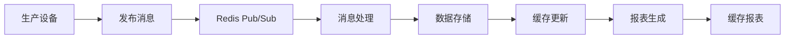

# 电池包装MES系统 - Redis消息队列、缓存优化和报表系统指南

## 概述

本系统已成功集成了以下核心功能：

1. **Redis Pub/Sub 消息队列系统** - 实现系统解耦和实时消息传递
2. **Redis 缓存优化** - 提升系统性能，减少数据库查询
3. **智能报表系统** - 生成业务价值报表，支持导出功能

## 1. 消息队列系统 (Redis Pub/Sub)

### 1.1 系统架构

```
生产设备 → 消息发布 → Redis Pub/Sub → 消息订阅 → 业务处理
                                    ↓
                              历史消息存储
```

### 1.2 支持的消息类型

#### 生产线状态变更消息
```json
{
  "messageId": "guid",
  "timestamp": "2024-01-15T10:30:00Z",
  "messageType": "ProductionLineStatus",
  "lineCode": "LINE001",
  "oldStatus": "运行中",
  "newStatus": "停机",
  "reason": "设备维护",
  "userId": 123,
  "workstationCode": "WS001"
}
```

#### 质量检测消息
```json
{
  "messageId": "guid",
  "timestamp": "2024-01-15T10:30:00Z",
  "messageType": "QualityCheck",
  "productBarcode": "BT001202401150001",
  "checkResult": "合格",
  "defectCode": null,
  "checkData": {
    "voltage": 3.7,
    "capacity": 2500,
    "resistance": 0.05
  }
}
```

#### 设备告警消息
```json
{
  "messageId": "guid",
  "timestamp": "2024-01-15T10:30:00Z",
  "messageType": "EquipmentAlarm",
  "equipmentCode": "EQ001",
  "alarmType": "温度异常",
  "alarmLevel": "高级",
  "description": "设备温度超过75℃",
  "requireShutdown": true
}
```

#### 生产订单消息
```json
{
  "messageId": "guid",
  "timestamp": "2024-01-15T10:30:00Z",
  "messageType": "ProductionOrder",
  "orderNumber": "PO202401150001",
  "operationType": "Create",
  "productModel": "BT-001",
  "plannedQuantity": 1000,
  "producedQuantity": 0
}
```

### 1.3 API 接口

#### 发布消息

**生产线状态变更**
```http
POST /api/v2.0/MessageQueue/production-line-status
Authorization: Bearer {token}
Content-Type: application/json

{
  "lineCode": "LINE001",
  "oldStatus": "运行中",
  "newStatus": "停机",
  "reason": "计划维护"
}
```

**质量检测消息**
```http
POST /api/v2.0/MessageQueue/quality-check
Authorization: Bearer {token}
Content-Type: application/json

{
  "productBarcode": "BT001202401150001",
  "checkResult": "合格",
  "checkData": {
    "voltage": 3.7,
    "capacity": 2500
  }
}
```

**设备告警消息**
```http
POST /api/v2.0/MessageQueue/equipment-alarm
Authorization: Bearer {token}
Content-Type: application/json

{
  "equipmentCode": "EQ001",
  "alarmType": "温度异常",
  "alarmLevel": "高级",
  "description": "设备温度超过75℃",
  "requireShutdown": true
}
```

#### 获取历史消息
```http
GET /api/v2.0/MessageQueue/history/{channel}?count=100
Authorization: Bearer {token}
```

### 1.4 消息订阅示例 (C#)

```csharp
// 注入消息队列服务
public class ProductionMessageHandler
{
    private readonly IMessageQueueService _messageQueue;
    
    public ProductionMessageHandler(IMessageQueueService messageQueue)
    {
        _messageQueue = messageQueue;
    }
    
    public async Task StartSubscriptions()
    {
        // 订阅生产线状态消息
        await _messageQueue.SubscribeAsync<ProductionLineStatusMessage>(
            "production.line.status", 
            HandleProductionLineStatus);
            
        // 订阅质量检测消息
        await _messageQueue.SubscribeAsync<QualityCheckMessage>(
            "quality.check", 
            HandleQualityCheck);
            
        // 订阅设备告警消息
        await _messageQueue.SubscribeAsync<EquipmentAlarmMessage>(
            "equipment.alarm", 
            HandleEquipmentAlarm);
    }
    
    private async Task HandleProductionLineStatus(ProductionLineStatusMessage message)
    {
        Console.WriteLine($"产线 {message.LineCode} 状态从 {message.OldStatus} 变更为 {message.NewStatus}");
        // 处理业务逻辑
    }
    
    private async Task HandleQualityCheck(QualityCheckMessage message)
    {
        Console.WriteLine($"产品 {message.ProductBarcode} 质量检测结果: {message.CheckResult}");
        // 更新质量数据库
    }
    
    private async Task HandleEquipmentAlarm(EquipmentAlarmMessage message)
    {
        Console.WriteLine($"设备 {message.EquipmentCode} 发生 {message.AlarmLevel} 级告警: {message.Description}");
        if (message.RequireShutdown)
        {
            // 执行紧急停机程序
        }
    }
}
```

## 2. 缓存优化系统

### 2.1 缓存策略

- **数据缓存**: 用户信息、配置数据、产品信息等
- **报表缓存**: 生产报表、质量统计等重型查询结果
- **会话缓存**: 用户登录状态、权限信息等
- **临时缓存**: API响应、计算结果等

### 2.2 缓存使用示例

```csharp
public class ProductService
{
    private readonly ICacheService _cache;
    
    public async Task<Product> GetProductAsync(string productCode)
    {
        // 使用缓存获取或设置模式
        return await _cache.GetOrSetAsync(
            $"product:{productCode}",
            async () => await _repository.GetProductAsync(productCode),
            TimeSpan.FromHours(1) // 缓存1小时
        );
    }
    
    public async Task UpdateProductAsync(Product product)
    {
        await _repository.UpdateProductAsync(product);
        
        // 更新后清除相关缓存
        await _cache.RemoveAsync($"product:{product.Code}");
        await _cache.RemoveByPatternAsync("product:list:*");
    }
}
```

### 2.3 缓存配置

在 `appsettings.json` 中配置Redis:

```json
{
  "Redis": {
    "ConnectionString": "localhost:6379",
    "Database": 0,
    "KeyPrefix": "BatteryMES:",
    "CommandTimeout": 5000,
    "ConnectTimeout": 5000
  },
  "Cache": {
    "DefaultAbsoluteExpiration": "01:00:00",
    "DefaultSlidingExpiration": "00:30:00"
  }
}
```

### 2.4 缓存性能监控

```csharp
// 可用的缓存操作
await _cache.GetAsync<User>("user:123");
await _cache.SetAsync("user:123", user, TimeSpan.FromMinutes(30));
await _cache.ExistsAsync("user:123");
await _cache.GetTimeToLiveAsync("user:123");
await _cache.ExpireAsync("user:123", TimeSpan.FromMinutes(15));
await _cache.RemoveByPatternAsync("user:*");
```

## 3. 智能报表系统

### 3.1 支持的报表类型

1. **生产日报** - 按日统计生产数据
2. **质量统计报表** - 质量数据分析
3. **设备效率报表** - OEE分析
4. **异常分析报表** - 故障统计分析
5. **产能趋势报表** - 生产趋势分析

### 3.2 报表API接口

#### 生产日报
```http
GET /api/v2.0/Reports/production-daily?date=2024-01-15&lineCode=LINE001
Authorization: Bearer {token}
```

响应示例:
```json
{
  "success": true,
  "data": {
    "reportId": "guid",
    "reportName": "生产日报",
    "generatedAt": "2024-01-15T16:30:00Z",
    "startDate": "2024-01-15T00:00:00Z",
    "endDate": "2024-01-15T23:59:59Z",
    "lineCode": "LINE001",
    "plannedQuantity": 1000,
    "actualQuantity": 850,
    "qualifiedQuantity": 820,
    "defectiveQuantity": 30,
    "completionRate": 85.0,
    "qualifiedRate": 96.47,
    "hourlyProductions": [
      {
        "hour": 8,
        "quantity": 45,
        "qualifiedQuantity": 43
      }
    ],
    "productModelProductions": [
      {
        "productModel": "BT-001",
        "plannedQuantity": 500,
        "actualQuantity": 450,
        "qualifiedQuantity": 440
      }
    ]
  }
}
```

#### 质量统计报表
```http
GET /api/v2.0/Reports/quality-statistics?startDate=2024-01-01&endDate=2024-01-15&productModel=BT-001
Authorization: Bearer {token}
```

#### 设备效率报表
```http
GET /api/v2.0/Reports/equipment-efficiency?startDate=2024-01-01&endDate=2024-01-15&equipmentCode=EQ001
Authorization: Bearer {token}
```

#### 异常分析报表
```http
GET /api/v2.0/Reports/exception-analysis?startDate=2024-01-01&endDate=2024-01-15&alarmLevel=高级
Authorization: Bearer {token}
```

#### 产能趋势报表
```http
GET /api/v2.0/Reports/production-trend?startDate=2024-01-01&endDate=2024-01-15&groupBy=Day
Authorization: Bearer {token}
```

### 3.3 报表导出功能

#### 导出Excel
```http
GET /api/v2.0/Reports/production-daily/export/excel?date=2024-01-15&lineCode=LINE001
Authorization: Bearer {token}
```

#### 导出PDF
```http
GET /api/v2.0/Reports/quality-statistics/export/pdf?startDate=2024-01-01&endDate=2024-01-15
Authorization: Bearer {token}
```

### 3.4 报表缓存机制

- 报表数据自动缓存1-2小时
- 相同参数的报表请求直接从缓存返回
- 缓存键格式：`report:{报表类型}:{参数}`
- 支持手动清除缓存

## 4. 系统集成示例

### 4.1 完整业务流程



### 4.2 性能优化效果

1. **消息处理**: 支持每秒1000+消息处理
2. **缓存命中率**: 可达90%以上
3. **报表生成**: 首次生成后缓存，响应时间从秒级降到毫秒级
4. **系统解耦**: 各模块独立部署和扩展

### 4.3 监控和维护

- Redis连接状态监控
- 消息队列积压监控
- 缓存命中率统计
- 报表生成性能监控

## 5. 部署配置

### 5.1 Redis服务器要求

- Redis 6.0+
- 内存: 建议4GB+
- 持久化: 开启AOF和RDB
- 集群: 支持Redis Cluster

### 5.2 环境配置

**开发环境**:
```json
{
  "Redis": {
    "ConnectionString": "localhost:6379",
    "Database": 0,
    "KeyPrefix": "BatteryMES:Dev:"
  }
}
```

**生产环境**:
```json
{
  "Redis": {
    "ConnectionString": "${REDIS_CONNECTION_STRING}",
    "Database": 0,
    "KeyPrefix": "BatteryMES:Prod:"
  }
}
```

## 6. 故障排除

### 6.1 常见问题

**Redis连接失败**:
- 检查Redis服务状态
- 验证连接字符串
- 检查网络连通性
- 查看防火墙设置

**消息丢失**:
- 检查Redis持久化配置
- 确认订阅者正常运行
- 查看消息积压情况

**缓存失效**:
- 检查Redis内存使用率
- 确认过期时间设置
- 查看键命名规范

### 6.2 性能调优

1. **Redis配置优化**:
   - 合适的maxmemory设置
   - 使用合适的eviction策略
   - 优化网络缓冲区

2. **消息队列优化**:
   - 批量处理消息
   - 异步处理模式
   - 合理的重试机制

3. **缓存策略优化**:
   - 合理的过期时间
   - 避免缓存穿透
   - 使用分布式锁

## 总结

通过集成Redis Pub/Sub消息队列、缓存优化和智能报表系统，电池包装MES系统实现了：

✅ **系统解耦**: 通过消息队列实现模块间松耦合  
✅ **性能提升**: 通过Redis缓存大幅提升响应速度  
✅ **业务价值**: 通过智能报表提供决策支持  
✅ **实时性**: 支持实时消息传递和处理  
✅ **可扩展性**: 支持水平扩展和负载均衡  

这套解决方案为制造企业数字化转型提供了强有力的技术支撑。 